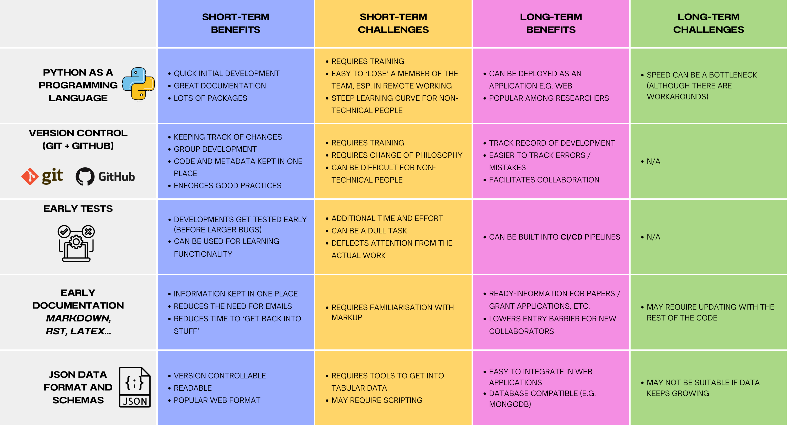

## Tomasz Janus
<!-- .slide: style="text-align: left;"> -->
<link rel="stylesheet" href="https://cdnjs.cloudflare.com/ajax/libs/font-awesome/4.7.0/css/font-awesome.min.css">

### Research Associate

<i class="fa fa-envelope"></i><a href="mailto:tomasz.janus@manchester.ac.uk"> tomasz.janus@manchester.ac.uk</a> 

<i class="devicon-linkedin-plain"></i> <a href="https://www.linkedin.com/in/tomasz-janus-6443b7198"> Linked<b>in</b> Profile</a>  

<i class="fa fa-github"></i> <a href="https://github.com/tomjanus"> github.com/tomjanus</a>

---

<!-- .slide: style="text-align: center;"> -->
<h2> <i style="color: #FF7A59">Open & Reproducible</i> in a Large Multinational Project? </h2>
<h3 class="r-fit-text"> Low-Emission Hydroelectric Dam Expansion Planning in Myanmar </h3>

---

## Presentation Plan

<section>
  
Project <b style="color: #c48560">Introduction</b>

  
Which <b style="color: #82401a">Open Research</b> Practices Have We Adopted and Why?

  
<b style="color:  #a6826d">Challenges, Benefits, Opportunitiess</b>

  
<b style="color: #694d3d">Lessons</b> Learned

  
What's in it for Us in the <b style="color: #824f35">Future</b>?

</section>

---

# The Team
<!-- .slide: style="text-align: center; font-size: 30px"> -->

<table>
  <tr>
    <td align="center"> <b>Tomasz Janus</b> (UoM-Tyndall) </td>
    <td align="center"> <b>Chris Barry</b> (UKCEH) </td>
    <td align="center"> <b>Kamilla Kopec-Harding</b> (Research IT) </td>
    <td align="center"> <b>Shelly Win </b> (IWMI Myanmar) </td>
    <td align="center"> <b>Aung Kyaw Kyaw </b> (Yangon University) </td>
    <td align="center"> <b>Jaise Kuriakose</b> (UoM-Tyndall) </td>
  </tr>
</table>

---

## Funding

This research was funded by the [University of Manchester](https://www.manchester.ac.uk/) and the [FutureDams](https://www.futuredams.org/) project.

<table style="border: 0px hidden white;margin-left:auto;margin-right:auto;">
  <tr>
<td align="center"><a href="https://www.manchester.ac.uk/"></td>
<td align="center"><a href="https://www.futuredams.org/"></td>
  </tr>
</table>

We also acknowledge the help received from [UKCEH](https://www.ceh.ac.uk/) and the support from [Research IT](https://research-it.manchester.ac.uk/)
<table style="border: 0px hidden white;margin-left:auto;margin-right:auto;">
  <tr>
<td align="center"><a href="https://www.ceh.ac.uk/"></td>
<td align="center"><a href="https://research-it.manchester.ac.uk/"></td>
  </tr>
</table>

---

## Part 1. Free Open Source Software
<!-- .slide: style="text-align: center; font-size: 30px"> -->

<section>
    

        

            <!-- Content for the left column goes here -->
            
        

        

            <!-- Content for the right column goes here -->
            

            
Geospatial Analysis of Reservoirs and Catchments with Google Earth Engine and Python

            

            
<a href="https://github.com/tomjanus/reemission">Estimation and Visualisation of GHG Emissions from Reservoirs</a>

            
We developed both packages out of necessity

        

    

</section>

---

## Part 2. Interpretation of Results
<!-- .slide: style="text-align: center; font-size: 30px"> -->

<section>
    

        

            <!-- Content for the left column goes here -->
            
        

        

            <!-- Content for the right column goes here -->
            

            
<i class="fa fa-eye" style="color:#b3482b"></i> Interpretations Provide Another Layer of Transparency

            
<i class="fa fa-exclamation" style="color:#b3482b"></i> Important for Gaining Confidence in Model Predictions

            
<i class="fa fa-handshake-o" style="color:#268758"></i> Useful source of information in decision-making

            
 
            

            
            
We used <a href="https://dalex.drwhy.ai/">DALEX</a> - A moDel Agnostic Language for Exploration and eXplanation implemented in <b>R</b> and <b>Python</b>.

            

        

    

</section>

---

## Part 3. Computation & Reproducibility
<!-- .slide: style="text-align: center; font-size: 30px"> -->

<section>
    

        

            <!-- Content for the left column goes here -->
            
        

        

            <!-- Content for the right column goes here -->
            

            
<i class="fa fa-eye" style="color:#cf961b"></i> Model and Algorithm parsimony helps with reproducibility

            
<i class="fa fa-btc" style="color:#b3482b"></i></i> Computation Costs Are Important for Reproducibility

            
<i class="fa fa-legal" style="color:#349cc2"></i> Deterministic vs. Stochastic (e.g. Genetic Algorithms)?

            
 
            

            
            
We used <a href="https://github.com/gomes-lab/Dam-Portfolio-Selection-Expansion-and-Compression-CPAIOR">a fully polynomial-time approximation scheme that approximates the Pareto frontier on tree-
structured networks of Bai et al.</a>

            

        

    

</section>

---

### Challenges - Benefits - Opportunities

---

<h2>Sharing Models with <i style="color: #FF7A59">Leaflet.js</i></h2>

<iframe class="r-stretch" 
style="border-radius: 20px; box-shadow: 15px 15px 35px rgba(180, 180, 180, 0.35);"
src="https://tomjanus.github.io/mya_emissions_map/" frameborder="0" allowfullscreen>
</iframe>

Source: <a href="https://tomjanus.github.io/mya_emissions_map/">  https://tomjanus.github.io/mya_emissions_map/</a>

---

<h2>Sharing results with <a href="https://plotly.com/examples/" style="color: #FF7A59">Plotly DASH</a></h2>

<iframe class="r-stretch" 
style="border-radius: 20px; box-shadow: 15px 15px 35px rgba(180, 180, 180, 0.35);"
src="https://drawit-moea-results.onrender.com/" frameborder="0" allowfullscreen>
</iframe>

Source: <a href="https://drawit-moea-results.onrender.com/">  https://drawit-moea-results.onrender.com/</a>

---

<!-- Place this in your header -->
<link rel="stylesheet" href="https://cdn.jsdelivr.net/gh/devicons/devicon@v2.14.0/devicon.min.css">

## Lowering entry barrier with <i class="devicon-docker-plain-wordmark"></i>

<pre><code data-line-numbers="1|3|5-8|10|12|14">FROM mcr.microsoft.com/mssql/server:2019-CU5-ubuntu-18.04

USER root

RUN mkdir /var/opt/sqlserver
RUN mkdir /var/opt/sqlserver/sqldata
RUN mkdir /var/opt/sqlserver/sqllog
RUN mkdir /var/opt/sqlserver/sqlbackups

RUN chown -R mssql /var/opt/sqlserver

USER mssql

CMD /opt/mssql/bin/sqlservr
</pre></code>

---