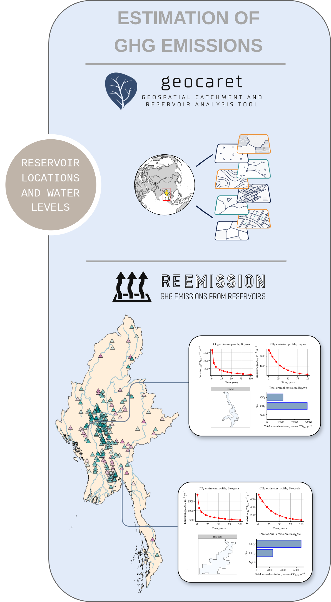
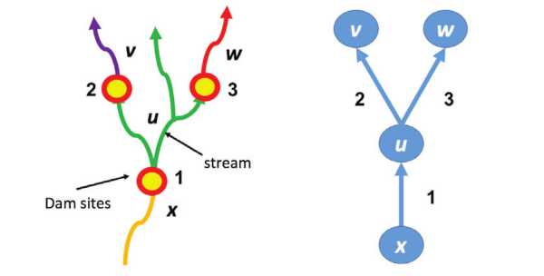

<link rel="stylesheet" href="https://cdn.jsdelivr.net/gh/devicons/devicon@v2.14.0/devicon.min.css">

## Tomasz Janus
<!-- .slide: style="text-align: left;"> -->
<link rel="stylesheet" href="https://cdnjs.cloudflare.com/ajax/libs/font-awesome/4.7.0/css/font-awesome.min.css">

### Research Associate

<i class="fa fa-envelope"></i><a href="mailto:tomasz.janus@manchester.ac.uk"> tomasz.janus@manchester.ac.uk</a> 

<i class="devicon-linkedin-plain"></i> <a href="https://www.linkedin.com/in/tomasz-janus-6443b7198"> Linked<b>in</b> Profile</a>  

<i class="fa fa-github"></i> <a href="https://github.com/tomjanus"> github.com/tomjanus</a>

---

<!-- .slide: style="text-align: center;"> -->
<h2> <i style="color: #FF7A59">Open & Reproducible</i> in a Large Multinational Project? </h2>
<h3 class="r-fit-text"> Low-Emission Hydroelectric Dam Expansion Planning in Myanmar </h3>

---

## Presentation Plan

<!-- 
 -->
<section>
  
Project <b style="color: #c48560">Introduction</b>

  
Which <b style="color: #82401a">Open Research</b> Practices Have We Adopted and Why?

  
<b style="color:  #a6826d">Benefits, Challenges, Opportunitiess</b>

  
<b style="color: #694d3d">Lessons</b> Learned

  
Outlook to the <b style="color: #824f35">Future</b>

</section>

---

# The Team
<!-- .slide: style="text-align: center; font-size: 30px"> -->

<table>
  <tr>
    <td align="center"> <b>Tomasz Janus</b> (UoM-Tyndall) </td>
    <td align="center"> <b>Chris Barry</b> (UKCEH) </td>
    <td align="center"> <b>Kamilla Kopec-Harding</b> (Research IT) </td>
    <td align="center"> <b>Shelly Win </b> (IWMI Myanmar) </td>
    <td align="center"> <b>Aung Kyaw Kyaw </b> (Yangon University) </td>
    <td align="center"> <b>Jaise Kuriakose</b> (UoM-Tyndall) </td>
  </tr>
</table>

---

## Funding

This research was funded by the [University of Manchester](https://www.manchester.ac.uk/) and the [FutureDams](https://www.futuredams.org/) project.

<table style="border: 0px hidden white;margin-left:auto;margin-right:auto;">
  <tr>
<td align="center"><a href="https://www.manchester.ac.uk/"></td>
<td align="center"><a href="https://www.futuredams.org/"></td>
  </tr>
</table>

We also acknowledge the help received from [UKCEH](https://www.ceh.ac.uk/) and the support from [Research IT](https://research-it.manchester.ac.uk/)
<table style="border: 0px hidden white;margin-left:auto;margin-right:auto;">
  <tr>
<td align="center"><a href="https://www.ceh.ac.uk/"></td>
<td align="center"><a href="https://research-it.manchester.ac.uk/"></td>
  </tr>
</table>

---

### Key Takeaways

 <ul id="small-text">
  <li id="padded-li">Achieving transparency and reproducibility in research requires many open research practices coming at once - open software/scripts/methodologies, open data, accessibility, auditability, claer comprehensive documentation, right model choices, and so on. The list is long.</li>
  <li id="padded-li">It is not always possible to tick all the boxes but aiming for transparency and openness and making your work reproducible by others will increase the impact of your work and reach more people.</li>
  <li id="padded-li">A lot of processes that we apply in open research are adopted from <b>IT</b> - version control, automated testing, documentation, integration pipelines, data custody, etc. and are difficult to achieve without the help of specialists. More high-level tools are needed for the research community that abstract some of these low level tasks and thus, reduce complexity and work-load.</li>
</ul> 

---

### Open-research concepts applied in our work

 <ol id="small-text">
  <li id="padded-li">Creating bespoke free open-source software.</li>
  <li id="padded-li">Adding explanations to model predictions using explainable AI (xAI) techniques. This step increases transparency by explaining which inputs and by how much contributed to predictions and is invaluable for decision makers.</li>
  <li id="padded-li">Using parsimonious fast and deterministic models helps with reproducibility and allows the readers to replicate your results without needing to access expensive computing facilities. This is in contrast to slower and/or stochastic algorithms such as e.g. Genetic Algorithms, that can be computationally intensive and do not guarantee reaching the (optimal) solution.</li>
  <li id="padded-li">Setting up model descriptions, configurations and inputs in text format such as JSON that can be version controlled and integrated into deployment pipelines such as GitHub actions. This ensures that everyone on the team can work with the most current version of the model and prevents mistakes due to people working on different versions of the model. Changes to the models are automatically integrated into workflows and can be visualised online using e.g. GitHub pages.</li>
  <li id="padded-li">Models and software can be optionally deployed in Docker containers ensuring that each user has the same working environment. This prevents mismatches due to incompatible/outdated packages and thus facilitates reproducibility.</li>
</ol> 

---

## Part 1. Free Open Source Software
<!-- .slide: style="text-align: center; font-size: 30px"> -->

    <!-- Content for the left column goes here -->
    

    <!-- Content for the right column goes here -->
    

    
Geospatial Analysis of Reservoirs and Catchments with Google Earth Engine and Python

    

    
<a href="https://github.com/tomjanus/reemission">Estimation and Visualisation of GHG Emissions from Reservoirs</a>

    
We developed both packages out of necessity

---

## Part 2. Model and Prediction Interpretations
<!-- .slide: style="text-align: center; font-size: 30px"> -->

    <!-- Content for the left column goes here -->
    

    <!-- Content for the right column goes here -->
    

    
<i class="fa fa-eye" style="color:#b3482b"></i> Interpretations Provide Another Layer of Transparency

    
<i class="fa fa-exclamation" style="color:#b3482b"></i> Important for Gaining Confidence in Model Predictions

    
<i class="fa fa-handshake-o" style="color:#268758"></i> Useful source of information for decision-making

    
 
    

    
    
We used <a href="https://dalex.drwhy.ai/">DALEX</a> - A moDel Agnostic Language for Exploration and eXplanation implemented in <b>R</b> and <b>Python</b>.

    

---

## Part 3. Computation & Reproducibility
<!-- .slide: style="text-align: center; font-size: 30px"> -->

    <!-- Content for the left column goes here -->
    

    <!-- Content for the right column goes here -->
    

    
<i class="fa fa-eye" style="color:#cf961b"></i> Model and Algorithm Parsimony helps Reproducibility

    
<i class="fa fa-btc" style="color:#b3482b"></i></i> Computation Costs/Effort May Affect Reproducibility

    
<i class="fa fa-legal" style="color:#349cc2"></i> Deterministic vs. Stochastic (e.g. Genetic Algorithms)?

    
 
    

    
    
We used <a href="https://github.com/gomes-lab/Dam-Portfolio-Selection-Expansion-and-Compression-CPAIOR">a fully polynomial-time approximation scheme that approximates the Pareto frontier on tree-
structured networks of Bai et al.</a>

    

---

### Benefits - Challenges - Opportunities

---

### Model and Data Representation in JSON
<!-- .slide: style="text-align: center; font-size: 30px"> -->

<h4 style="font-size: 28px">Water Model</h4>
<pre><code class="language-json" data-line-numbers="|2-6|7-11|12-19|31-34">{
  "metadata": {
    "title": "Reservoir 1",
    "description": "",
    "minimum_version": "0.1"
  },
  "timestepper": {
    "start": "2015-01-01",
    "end": "2015-12-31",
    "timestep": 1
  },
  "nodes": [
    {
      "name": "supply1",
      "type": "Storage",
      "max_volume": 35,
      "initial_volume": 35,
      "outputs": 0
    },
    {
      "name": "link1",
      "type": "Link"
    },
    {
      "name": "demand1",
      "type": "Output",
      "max_flow": 10,
      "cost": -10
    }
  ],
  "edges": [
    ["supply1", "link1"],
    ["link1", "demand1"]
  ]
}
</pre></code>

<h4 style="font-size: 28px">Emissions Model</h4>
<pre><code class="language-json" data-line-numbers="|3-11|12-32|33-52">{
  "Reservoir 1": {
    "id": 1,
    "type": "hydroelectric",
    "monthly_temps": [
      13.9, 16.0, 19.3, 22.8, 
      24.2, 24.5, 24.2, 24.3, 
      23.9, 22.1, 18.5, 14.8
    ],
    "year_vector": [1, 5, 10, 20],
    "gasses": ["co2", "ch4", "n2o"],
    "catchment": {
      "runoff": 1115.0,
      "area": 12582.6,
      "riv_length": 0.0,
      "population": 1587524,
      "area_fractions": [
        0.0, 0.0, 0.003, 0.002, 0.001, 
        0.146, 0.391, 0.457, 0.0
      ],
      "slope": 23.0,
      "precip": 1498.0,
      "etransp": 1123.0,
      "soil_wetness": 144.0,
      "mean_olsen": 5.85,
      "biogenic_factors": {
        "biome": "tropical moist broadleaf",
        "climate": "temperate",
        "soil_type": "mineral",
        "treatment_factor": "primary (mechanical)"
      }
    },
    "reservoir": {
      "volume": 7238166.0,
      "area": 1.60,
      "max_depth": 22.0,
      "mean_depth": 4.5,
      "area_fractions": [
        0.0, 0.0, 0.0, 0.0, 0.0, 0.45, 
        0.15, 0.4, 0.0, 0.0, 0.0, 0.0, 
        0.0, 0.0, 0.0, 0.0, 0.0, 0.0, 
        0.0, 0.0, 0.0, 0.0, 0.0, 0.0, 
        0.0, 0.0, 0.0
      ],
      "soil_carbon": 6.281,
      "mean_radiance": 4.66,
      "mean_radiance_may_sept": 4.328,
      "mean_radiance_nov_mar": 4.852,
      "mean_monthly_windspeed": 1.08,
      "water_intake_depth": null
    }
  }
}
</pre></code>

---

<h2>Sharing Models with <i style="color: #FF7A59">Leaflet.js</i></h2>

<iframe class="r-stretch" 
style="border-radius: 20px; box-shadow: 15px 15px 35px rgba(180, 180, 180, 0.35);"
src="https://tomjanus.github.io/mya_emissions_map/" frameborder="0" allowfullscreen>
</iframe>

Source: <a href="https://tomjanus.github.io/mya_emissions_map/">  https://tomjanus.github.io/mya_emissions_map/</a>

---

### Outsourcing computation and data storage

---

## Containerising with <i class="devicon-docker-plain-wordmark"></i>
<!-- .slide: style="text-align: center; font-size: 30px"> -->

<pre><code class="language-docker" data-line-numbers="1|9-13|15-16">ARG PYTHON_VERSION=3.8.18
FROM python:${PYTHON_VERSION}-slim as base
ENV PYTHONDONTWRITEBYTECODE=1
ENV PYTHONUNBUFFERED=1
RUN apt-get update -y
RUN apt install curl -y
ENV PATH=/google-cloud-sdk/bin:$PATH
WORKDIR /
RUN export CLOUD_SDK_VERSION="410.0.0" && \
    curl -O https://dl.google.com/dl/cloudsdk/channels/rapid/downloads/google-cloud-sdk-${CLOUD_SDK_VERSION}-linux-x86_64.tar.gz && \
    tar xzf google-cloud-sdk-${CLOUD_SDK_VERSION}-linux-x86_64.tar.gz && \
    rm google-cloud-sdk-${CLOUD_SDK_VERSION}-linux-x86_64.tar.gz && \
    ln -s /lib /lib64
RUN useradd --create-home --shell /bin/bash appuser
COPY requirements.txt .
RUN python -m pip install -r requirements.txt
USER appuser
RUN mkdir -p /home/appuser/geocaret
WORKDIR /home/appuser/geocaret
COPY --chown=appuser:appuser . .
ENTRYPOINT [ "/bin/bash", "./docker_entrypoint.sh" ]
CMD [ "echo", "You must specify a command to run. See README.Docker.md for details." ]
</pre></code>

---

### Lessons Learned

<section>
  
1. Open Research requires <i style="color: #d16d45">additional resources and long-term planning</i>

  
2. This paradigm shift can be a <i style="color: #d16d45">barier for adoption</i>

  
3. Open Research borrows a lot from IT - <i style="color: #d16d45">technologically challenging</i>

  
4. <i style="color: #2a74ad">Should be accounted for in project bids</i>

  
5. <i style="color: #37871a">Enforces good practices</i>

  
6. <i style="color: #37871a">Increases Impact</i>

</section>

---

### Outlook to the Future

<section>
  
1. <i style="color: #a87e2a">More Interactive Publishing </i> (paper with code in one place)</b>

  
2. <i style="color: #a87e2a">Bespoke Tools and Platforms</i> for Open Reproducible Research - higher level abstraction

  <!-- 
3. <i style="color: #a87e2a">Increased</i> emphasis on <i style="color: #a87e2a">opennes and reproducibility</i> by publishers and reviewers
 -->
  <!-- 
3. <i style="color: #a87e2a">Research</i>-focused <i style="color: #a87e2a">Social Network?</i>
 -->
  
3. Who/What is the end-user of our outputs?

</section>

---

#### This presentation was made with <a style="color:#e6af19" href="https://revealjs.com">reveal.js</a>
---

#### The source code can be found <i class="fa fa-github"></i> at <a href="https://github.com/tomjanus/openresearch2024-presentation">https://github.com/tomjanus/openresearch2024-presentation</a>
---

#### Please visit us later for updates

<a style="font-size: 35px" href="https://tomjanus.github.io/openresearch2024-presentation/">https://tomjanus.github.io/openresearch2024-presentation/</a>

